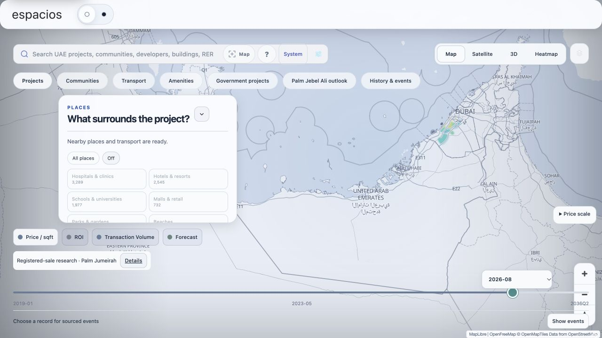
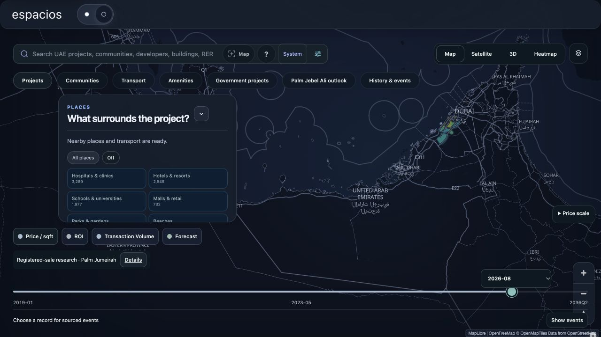
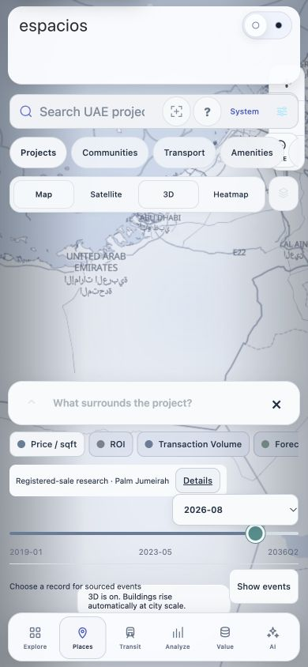
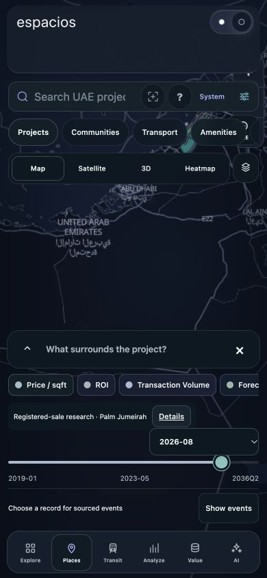
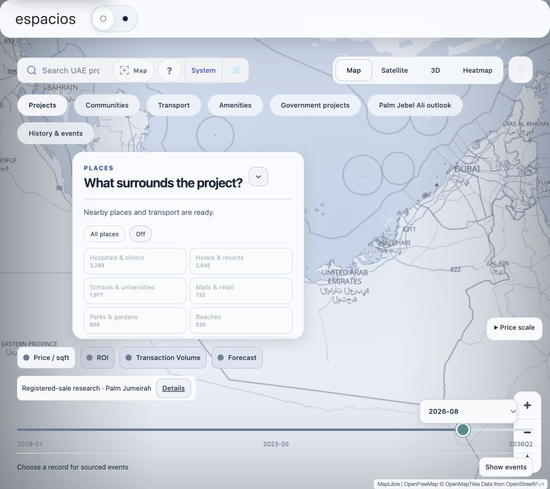

# Espacios map V36 — live verification, 8 October 2026

The selected Map control uses the shared Espacios light/dark surface with a muted border and stronger label. The previous navy block and gold accents came from inherited premium-shell styling and have no analytical meaning. V36 retains the existing softer palette and fixes desktop panel overlap with the search/category rows.

## Production

- Worker: `psr-portfolio-map-v2`
- Version: `f332a69c-c36c-427e-82ea-6887a2ab51e0`, 100% traffic
- Deployment: `e68ebf28-410c-4cdd-83b1-251b61645628`
- Frontend token: `20261008-map-palette-v36`
- Data: unchanged `20261008-enrichment-v31`; all 1,860 records preserved
- Cloudflare route readback: `espacios.me/map* -> espacios-map-shell`; shell service binding `MAP -> psr-portfolio-map-v2`
- Data Room remains restricted (`DATA_ROOM_PUBLIC=false`; public HTTP 404).

## Verification

Build, syntax checks and 27 focused map tests passed. Live HTML, JS, CSS and record-history API return HTTP 200. The host restriction rejects preview/localhost Map pages; final visual acceptance was performed on the canonical production route. V35's initial panel selector was overridden by an inherited ID selector; V36 corrects its specificity.

Measured live results:

| View | Category bottom | Panel top | Panel bottom | Timeline top | Page width / scroll width |
| --- | --- | --- | --- | --- | --- |
| Desktop | 190px | 202px | 475px | 487px | 1280 / 1280px |
| Tablet with wrapped categories | 236px | 248px | 555px | 567px | 900 / 900px |
| Mobile | Bottom-sheet behavior retained | — | — | — | 390 / 390px |

The selected Map background is `rgb(248,250,252)` with `rgb(32,48,68)` text in light mode and `rgb(11,24,33)` with `rgb(237,246,243)` text in dark mode. Mobile Map → 3D → Map switching updates `aria-pressed` correctly. These checks cover the changed controls and panel placement; they do not certify every map/data workflow or full historical completeness.

## Next evidence work

Continue the pending RAK Properties source review and exact project/phase verification, then publish only reviewed additions. Its local pass-32 draft is not part of this UI deployment. The V31 research checklist still has 39,528 of 42,780 requirements unresolved (92.40%); this is not a percentage of missing historical prices. Complete lifetime histories and validated annual forecasts through 2080 remain unestablished.
